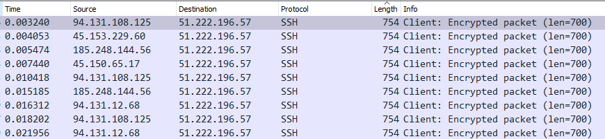
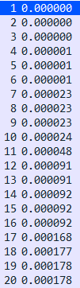
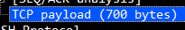
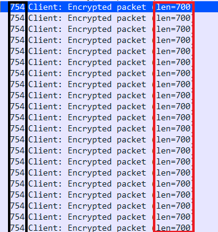
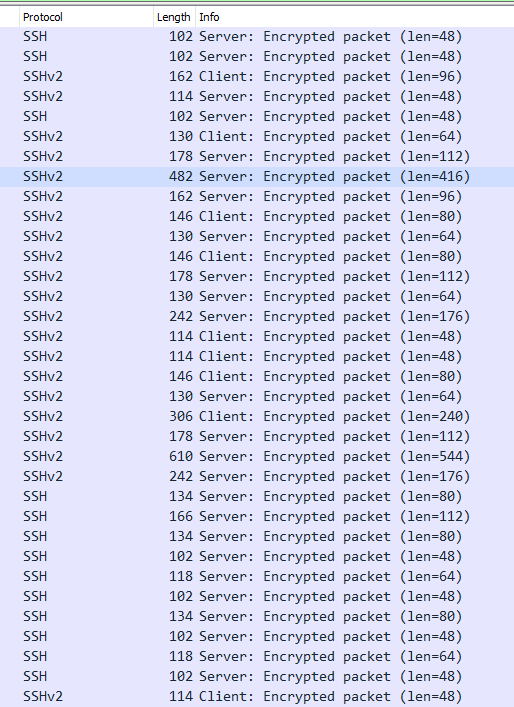
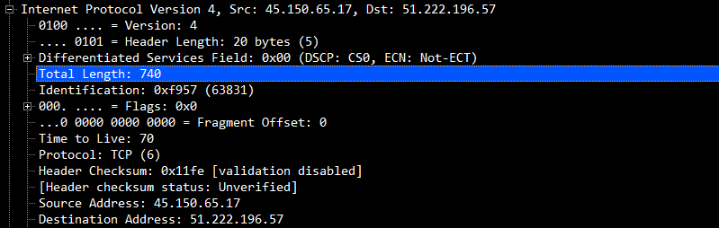
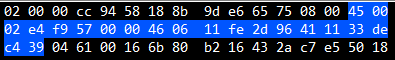
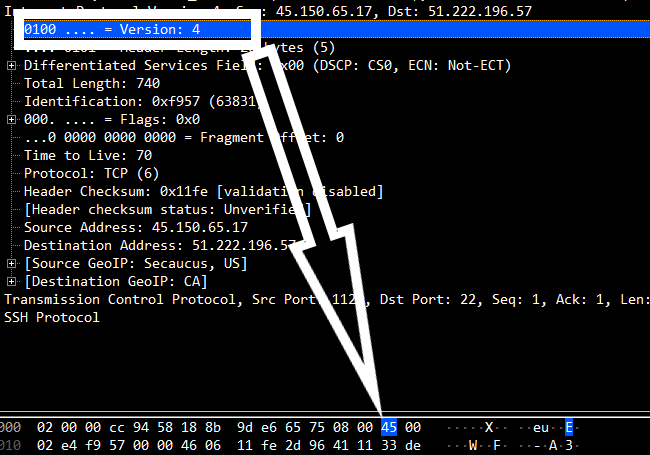
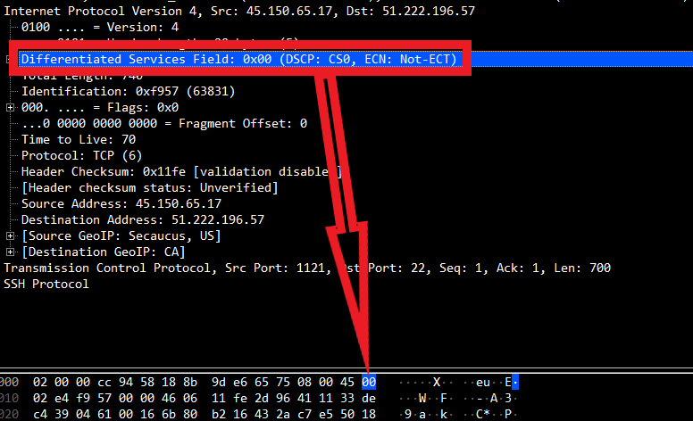
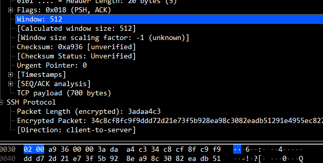

<h1>1.0 Berkeley Packet Filter</h1>

Linux Socket Filtering (LSF) is derived from the Berkeley Packet Filter. Though there are some distinct differences between the BSD and Linux Kernel filtering, but when we speak of BPF or LSF in Linux context, we mean the very same mechanism of filtering in the Linux kernel.

<h2>Requirements</h2>

First of all, let us take a look at the requirements to use the BPF.

<ul>
    <li>
        Tcpdump
    </li>
    <li>
        A VPS with linux kernel
    </li>
    <li>
        NBPF Compiler <a href="https://github.com/oaui/BPF-Berkeley-Filter/blob/main/BPF%20docu/requirements/nbpf_compile.c">Click here to download the file</a>
    </li>
    <li>
        <a href="https://github.com/oaui/BPF-Berkeley-Filter/blob/main/BPF%20docu/requirements/setup.md">VPS Setup</a>
    </li>
</ul>

Once you have completed the steps above, come back here and continue below.

<h2>Understanding the concept</h2>
 

We will be analyzing a .pcap file of a DDOS attack which uses the SSH / SSH/2 protocol and long packet strings to overwhelm the target with traffic and big packets. Furthermore, we will be trying to create something which catches the packets and manages them as we want.

 

As you can see, the picture above shows packets with very long byte strings and lengths.

I sorted the packets with increasing numbers downwards by simply clicking on the "Length" tab. This helps us to detect a structure of the attack, as TCPDUMP does not support timestamps, this is not an option for us.

<h4>Useless for us:</h4>

<h2>What do we need instead?</h2>

Well, that hardly depends on the packets sent.

In our case, every packet is encrypted and unreadable for non binary-speaking individuals. 
    Explanation: We are unable to drop the packets by just blocking the length, as it does not contain the real byte string.

<h3>BUT:</h3>

In theory, we could get the real packet length, by taking the full packet size, which is 754 in our case and substract it from the number, which is set for the TCP payload. So basically "754 - 700" for the first few packets which are shown in our capture.

 

This shows us the real size of the TCP payload which was sent to our server:

And here we are able to see the numbers in comparsion if we look at the "info" tab in wireshark.

 

Further, this is what real and legit SSH traffic exchange look like between server and client who started a new connection to the host. This example gives us an idea, what the real case should look like.

<h2>And how does this help us?</h2>

Well, now that we know, what DDOS on SSH level looks like and what real traffic should look like in theory, we will have to find out, how to select those segments in the context of BPF and TCPDUMP.

 
 
<h1>1.1 Using TCPDUMP and NBPF compiler to capture the bytecode we need</h1>

I added a file to <a href="https://github.com/oaui/BPF-Berkeley-Filter/blob/main/BPF%20docu/syntax/Syntax%20and%20Usage.txt">Syntax</a> where I documented all important commands for the NBPF compiler. I would appreciate, if you somehow credit me when sharing it with third parties.

<h2>1.1.1 Inspecting the packet</h2>
<h4>So let us take a look at the IP header of the first packet and see what we can do with it.</h4>

It contains important offsets which can be very helpful in different scenarios.

 

For our case, we will be taking a closer look at the already marked "Total length" field of the IP header.

 
 

As you can see, the IP header is 20 bytes long, starting to count at the first byte, which is not correct as we always start to count at 0 when we are working with computer related numbers or binary language >>> This means, that the "1st byte" is located at the 

<h3>0th byte:</h3>

<h3>"Real" 1st byte:</h3>

 

This might be very confusing at the beginning, but basically just keep in mind, that the first byte of the IP header is not asigned to the number 1 in terms of dumping bytecode and TCPDUMP.

<h3>1.1.2 The real reason</h3>
 

So, some of you might not have understood, why I even wrote all that down or how counting bytes is done correctly, but this does not matter as I will give an example related to our case. So lets select the total length which is located at the

<h3>2nd byte</h3>

Further, we have to consider, that the 2nd byte is 2 bytes long, or 16 nibble. Where every number equals one nibble and one nibble is equal to 4 bit. So, if you take a look at the picture above, 0 would be a nibble, 2 would be a nibble, which is equal to 1 byte (as 1 nibble == 4 bit and 4 bit + 4 bit == 1 byte), e would be a nibble and 4 would be a nibble, which are 4 parts (basically just 4 times 4) or 2 bytes.

 

So, our command to dump the length of our header would be ip[2:2] = 740 right?

That is true, BUT:

 

As we already learned, what real SSH traffic looks like, we do not want to drop only that number, but every single packet which has a suspicous length. And this is where other operators like "<" and ">" join the game.

 

Means, the command should be ip[2:2] > 1024 as we want to drop every packet which is suspected of DDOS and not real traffic. You can also change 1024 to 512, to make your bytecode more strict, I will leave it at 1024 for now, as no SSH packet which is being exchanged in a real connection between client and server should be greater than 1024 bytes.

 
<h3>1.2 Dumping the bytecode</h3>

Now, if we combine the command for the IP header with our compiler (./nbpf_compile 'ip[2:2] > 1024'), we get the following output.

<h2>7,48 0 0 0,84 0 0 240,21 0 3 64,40 0 0 2,37 0 1 1024,6 0 0 65535,6 0 0 0</h2>
<h3>But is that what we really wanted?</h3>

Well, yes as we are now able to drop payloads which are longer than 1024 (or 512) bytes using bytecode. And thats what we wanted, as this will select ALL packets (not matter TCP or UDP) which are to big to be legitimate traffic. You can fix the issue with the protocol by simply adding "ip[9] = 6" this will tell the compiler, that only TCP packets should be affected.

The command should look like this:

<h3>./nbpf_compile 'ip[2:2] > 1024 and ip[9] = 6'</h3>
 

But, there is another significant offset, which is capable of showing us, that the packet is not legitimate.

Namely, the TCP window.

Which is located at the 14th byte of the TCP header, means:

<h3>./nbpf_compile 'tcp[14:2] < 4096 or ip[2:2] > 1024'</h3>

Seperated with an "or" operator, we are telling the compiler, to select all packets with a window smaller than 4096 (as basically no packet is / should be smaller than 8192) OR packets, with a length bigger than 1024 (or 512)

The output of this should look like this:

<h3>14,48 0 0 0,84 0 0 240,21 0 10 64,48 0 0 9,21 0 5 6,40 0 0 6,69 3 0 8191,177 0 0 0,72 0 0 14,53 0 2 4096,40 0 0 2,37 0 1 1024,6 0 0 65535,6 0 0 0</h3>

or:

<h3>1.3 The final product</h3>
<h3>iptables -t mangle -A PREROUTING -p tcp -m bpf --bytecode "14,48 0 0 0,84 0 0 240,21 0 10 64,40 0 0 2,37 0 8 512,48 0 0 9,21 0 6 6,40 0 0 6,69 4 0 8191,177 0 0 0,72 0 0 14,53 1 0 4096,6 0 0 65535,6 0 0 0" -j DROP</h3>
 
<h2>2.0 Conclusion:</h2>
 

In combination with connction tracking and / or other rules, this can really help stopping pure SSH floods which are based on PSH,ACK.

Feel free to try things out and if any help is needed, leave a comment or send me a message at:

<a href="https://t.me/cxmmand">Telegram</a>
 
<a href="https://discordapp.com/users/1084937449379209307">Discord</a>