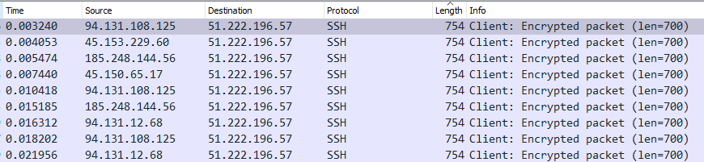
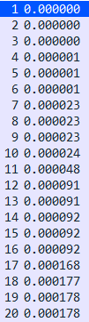
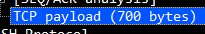
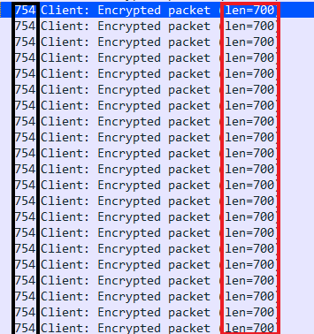
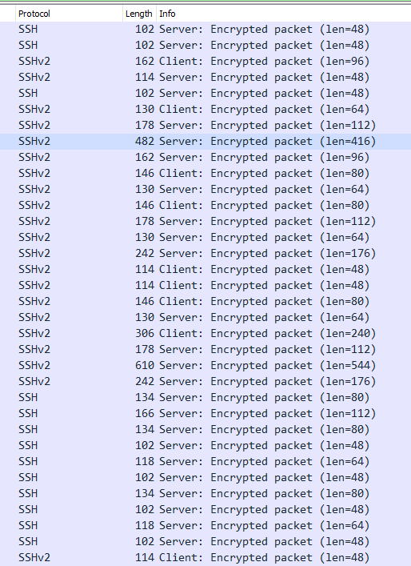

<h1>1.0 Berkeley Packet Filter</h1>

Linux Socket Filtering (LSF) is derived from the Berkeley Packet Filter. Though there are some distinct differences between the BSD and Linux Kernel filtering, but when we speak of BPF or LSF in Linux context, we mean the very same mechanism of filtering in the Linux kernel.

<h2>Requirements</h2>

First of all, let us take a look at the requirements to use the BPF.

<ul>
    <li>
        Tcpdump
    </li>
    <li>
        A VPS with linux kernel
    </li>
    <li>
        NBPF Compiler <a href="https://github.com/oaui/BPF-Berkeley-Filter/blob/main/BPF%20docu/requirements/nbpf_compile.c">Click here to download the file</a>
    </li>
    <li>
        <a href="https://github.com/oaui/BPF-Berkeley-Filter/blob/main/BPF%20docu/requirements/setup.md">VPS Setup</a>
    </li>
</ul>

Once you have completed the steps above, come back here and continue below.

<h2>Understanding the concept</h2>
 

We will be analyzing a .pcap file of a DDOS attack which uses the SSH / SSH/2 protocol and long packet strings to overwhelm the target with traffic and big packets. Furthermore, we will be trying to create something which catches the packets and manages them as we want.

 

As you can see, the picture above shows packets with very long byte strings and lengths.

I sorted the packets with increasing numbers downwards by simply clicking on the "Length" tab. This helps us to detect a structure of the attack, as TCPDUMP does not support timestamps, this is not an option for us.

<h4>Useless for us:</h4>

<h2>What do we need instead?</h2>

Well, that hardly depends on the packets sent.

In our case, every packet is encrypted and unreadable for non binary-speaking individuals. 
    Explanation: We are unable to drop the packets by just blocking the length, as it does not contain the real byte string.

<h3>BUT:</h3>

In theory, we could get the real packet length, by taking the full packet size, which is 754 in our case and substract it from the number, which is set for the TCP payload. So basically "754 - 700" for the first few packets which are shown in our capture.

 

This shows us the real size of the TCP payload which was sent to our server:

And here we are able to see the numbers in comparsion if we look at the "info" tab in wireshark.

 

Further, this is what real and legit SSH traffic exchange look like between server and client who started a new connection to the host. This example gives us an idea, what the real case should look like.

<h2>And how does this help us?</h2>

Well, now that we know, what DDOS on SSH level looks like and what real traffic should look like in theory, we will have to find out, how to select those segments in the context of BPF and TCPDUMP.

 
 
<h1>1.1 Using TCPDUMP and NBPF compiler to capture the bytecode we need</h1>

I added a file to <a href="">
